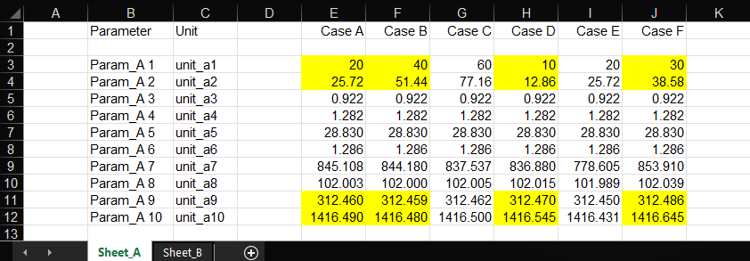
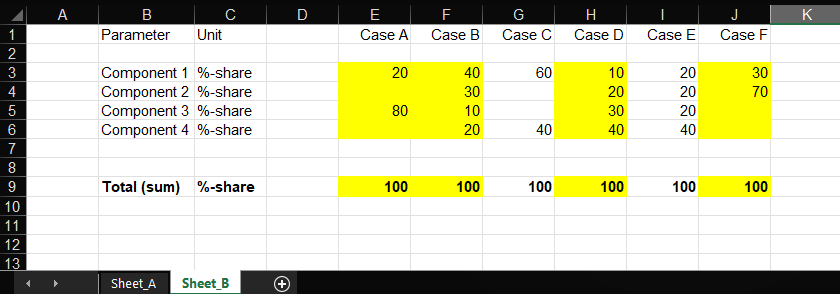
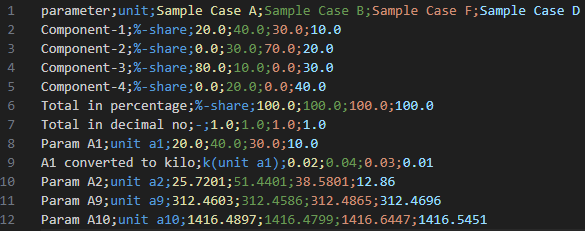

# XLS Rows and Columns to CSV
A simple Python script to extract a selected data from a given Excel file (*.xls, *.xlsx). It requires a definition of rows and columns, from where the selected data is then combined into a CSV file for further processing.

Note that extracted data shall be numerical, since the purpouse of this script is to use it for further processing in engineering calculations, therefore extracted data is supplemented with parameter name and its unit when converted into CSV file.

## Technologies used
* Python

## Installation
1. Clone the project to a directory on a local machine:
    ```sh
    git clone https://github.com/pawelkozolub/xls_rows_cols_to_csv.git
    ```
2. Go to project directory:
    ```sh
    cd xls_rows_cols_to_csv
    ```
3. It is recommended to create an isolated Python virtual environment in the project directory and install required dependiences from `requirements.txt` for it: 
    ```sh
    python3 -m venv .venv
    .\.venv\Scripts\python -m pip install -r requirements.txt
    ```
4. To run the script use the python instance from the virtual environment previously created:
    ```sh
    .\.venv\Scripts\python main.py
    ```

## Usage example
The script requires two configuration files to be defined. First one, a main file `config.toml` contains path to a separate configuration file (`config_data` entry) used for data selection, where rows and columns for data to be extracted are defined. This file also defines directory and files where input and output data are stored. An exemplary settings of `config.toml` are shown below:

```python
# Config file for data selection (rows and columns)
config_data = "sample_data/config_data.toml"

# Input/output data directory (relative path, e.g. ../data) and file names
data_dir = "sample_data"
input_file = "workbook_1.xlsx"
output_file = "results.csv"
```

The second configuration file (its path definded in `config.toml`) determines which data from the Excel workbook to be extracted. A sample of such a definition is presented below. The data input is organized by two groups of data sets, namely `column_data` and `row_data`. 

```python
# Config file for data selection (rows and columns)

# Columns definition:
# column_name (for data selection) = "case name (column name in CSV file)"
[column_data]
E = "Sample Case A"
F = "Sample Case B"
J = "Sample Case F"
H = "Sample Case D"

# Rows definition: 
# tag = ["tab name", "row no (for data selection)", "name", "unit = source unit", conversion (multiplier, 1.0 if no conversion), "unit after conversion"
[row_data]
# Components
comp1 = {tab="Sheet_B", row="3", name="Component-1", unit_src="%-share", conv=1.0, unit="%-share"}
comp2 = {tab="Sheet_B", row="4", name="Component-2", unit_src="%-share", conv=1.0, unit="%-share"}
comp3 = {tab="Sheet_B", row="5", name="Component-3", unit_src="%-share", conv=1.0, unit="%-share"}
comp4 = {tab="Sheet_B", row="6", name="Component-4", unit_src="%-share", conv=1.0, unit="%-share"}
# Totals
total_pct = {tab="Sheet_B", row="9", name="Total in percentage", unit_src="%-share", conv=1.0, unit="%-share"}
total_dec = {tab="Sheet_B", row="9", name="Total in decimal no", unit_src="%-share", conv=0.01, unit="-"}
# Parameters
param1 = {tab="Sheet_A", row="3", name="Param A1", unit_src="unit a1", conv=1.0, unit="unit a1"}
param2 = {tab="Sheet_A", row="3", name="A1 converted to kilo", unit_src="unit a1", conv=0.001, unit="k(unit a1)"}
param3 = {tab="Sheet_A", row="4", name="Param A2", unit_src="unit a2", conv=1.0, unit="unit a2"}
param4 = {tab="Sheet_A", row="11", name="Param A9", unit_src="unit a9", conv=1.0, unit="unit a9"}
param5 = {tab="Sheet_A", row="12", name="Param A10", unit_src="unit a10", conv=1.0, unit="unit a10"}
```

Parameters set in `column_data` are used to select from which colum names of the Excel workbook data need to be extracted. It allows also to define a column name to be used in the resulting CSV file. In the current version of the program the cases presented in columns correspond to each other between the Excel sheets (i.e. `Sheet_A` and `Sheet_B`). 

Parameters set in `row_data` are used to select from which row numbers of the Excel workbook data need to be extracted. Since many Excel sheets may be used `tab` parameter selects from which sheet data is extracted. Parameters set in  `name` and `unit` are used in the resulting CSV file to describe parameter and its unit. Entry named `unit_src` is used for clarity, it denotes unit used in the source Excel workbook. Extracted values can be converted using `conv` multiplication factor in order convert it to a different unit (if no conversion is required a default value of 1.0 need to be applied).

Following figures present Excel datasheets from where data is extracted using configuration files as presented above. Extracted data is marked by yellow color.





Resulting CSV file presents as following (data colored by corresponding columns):




## Release History
* 0.1.0
    * Initial release

## Authors and Contributors
* [@pawelkozolub](https://github.com/pawelkozolub)

## License
Distributed under the MIT License. See LICENSE.txt for more information.